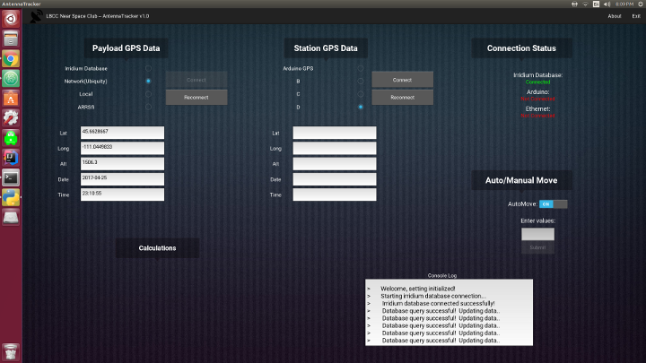

# 

Software to control a pair of receiving stations while they track a high
altitude balloon.

This software was written by OSU and LBCC students to control a pair of antenna
stations which point a receiving dish at a high altitude balloon payload while
it's in the air.  The tracking stations are equipped with a receiving dish with
a very narrow beam width which must be pointed very accurately in order to
receive a live video transmission from the balloon payload.

This software runs on two very different receiving stations.

One station is stationary and uses a pair of servo motors to move the dish.

The other station is mobile, mounted on the deck of the
[R/V Pacific Storm](http://ceoas.oregonstate.edu/pacificstorm/), and
must handle the motion of the ship and waves.  This station uses stepper
motors with a 15:1 planetary gearbox, which gives us 3000 steps per revolution
and 0.12 degrees per step.  This is significantly more accurate than our
previous servo solution, which was limted to 1.41 degrees per step.

## Install

Install pip, then from the main directory:

```
sudo pip install -r requirements.txt
```

## Usage:

```
python3 AntennaTracker.py
```

More usage instructions will follow as we continue to develop the system.
